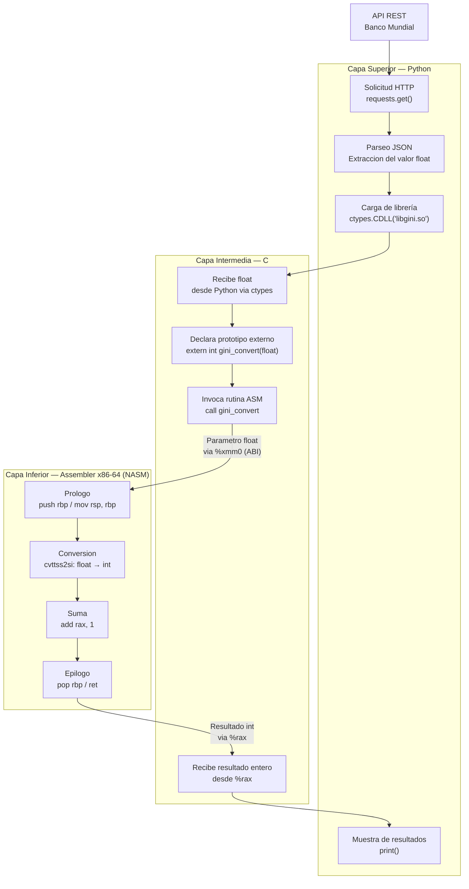

# Trabajo Practico N°2

## Calculadora de Indices

**Materia:** Sistemas de Computación  
**Grupo:** asm_noobs  
**Integrantes:** [Fabian Nicolas Hidalgo] · [Juan Manuel Caceres] · [Agustin Alvarez]

---

### Introducción

El presente trabajo práctico consiste en el diseño e implementación de un sistema multicapa para consultar y procesar el índice GINI desde la API del Banco Mundial. El sistema se estructura en tres capas:

- **Capa superior (Python):** consume la API REST y pasa los datos a la capa intermedia.
- **Capa intermedia (C):** recibe los datos flotantes y llama a rutinas en assembler.
- **Capa inferior (Assembler x86-64):** realiza la conversión de float a entero y le suma uno, devolviendo el resultado mediante el stack.

#### El índice GINI

Es una medida estadística que cuantifica la desigualdad en la distribución del ingreso dentro de una población. Su valor oscila entre 0 y 100, donde 0 representa una igualdad perfecta (todos los individuos tienen el mismo ingreso) y 100 representa una desigualdad máxima (una sola persona concentra todo el ingreso).

Los datos se obtienen de la API REST pública del Banco Mundial, que devuelve registros en formato JSON con el valor del índice GINI por país y por año. 

```
https://api.worldbank.org/v2/country/arg/indicator/SI.POV.GINI?format=json&date=2011:2020
```

#### Iteraciones

**Iteración 1 — Python + C sin Assembler:** se construye la arquitectura completa del sistema (consulta a la API, paso de datos a C, cálculo y muestra de resultados) usando solo Python y C. El objetivo es validar el flujo de datos y la integración entre capas antes de introducir assembler, de modo que los errores de lógica puedan aislarse de los errores de bajo nivel.

**Iteración 2 — Integración con Assembler:** se reemplaza la lógica de conversión `float → entero` y la operación de suma `+1` por una rutina escrita en NASM. C actúa como puente, invocando la función de Assembler y pasándole los parámetros conforme a la ABI. Se utiliza GDB para mostrar el estado del stack en los tres momentos clave de la llamada: antes, durante y después.

---

### Arquitectura

El sistema se organiza en tres capas con responsabilidades bien definidas. Los datos fluyen desde la API pública hacia abajo hasta el ensamblador, y el resultado procesado regresa hacia arriba hasta la presentación en pantalla.

#### Diagrama de flujo



#### Capa Superior — Python

Es la única capa con acceso a internet. Usa la librería `requests` para consultar la API REST del Banco Mundial y obtiene la respuesta en formato JSON. De esa respuesta extrae el valor del índice GINI como número de punto flotante (`float`). Luego, mediante `ctypes`, carga la librería compartida `libgini.so` compilada desde C y llama a la función de conversión pasándole ese valor. Finalmente recibe el resultado entero y lo muestra por pantalla.

*Tecnología de comunicación hacia abajo:* `ctypes.CDLL` + definición explícita de tipos de argumento y retorno.

#### Capa Intermedia — C

Actúa como puente entre el mundo de alto nivel y assembler. Su rol es recibir el `float` desde Python, declarar el prototipo de la función ensambladora con `extern`, e invocarla respetando la convención de llamadas **System V AMD64 ABI**. Cuando la rutina ASM retorna, C recoge el entero resultante desde el registro `%rax` y lo devuelve hacia Python.

C también es responsable de compilarse como librería compartida (`.so`), lo que permite que Python la cargue dinámicamente en tiempo de ejecución sin necesidad de un ejecutable separado.

*Tecnología de comunicación hacia abajo:* llamada a función con parámetros pasados por registro (`%xmm0` para el `float`) según la ABI, con resultado devuelto en `%rax`.

#### Capa Inferior — assembler x86-64 (NASM)

Es el núcleo de cómputo. Implementa la función `gini_convert`, que recibe el valor flotante del GINI, lo convierte a entero truncando los decimales mediante la instrucción `cvttss2si`, le suma 1, y devuelve el resultado en el registro `%rax`. Gestiona manualmente el stack frame, abre el frame con el prólogo (`push rbp` / `mov rsp, rbp`) y lo cierra con el epílogo (`pop rbp` / `ret`), respetando en todo momento las convenciones de la ABI para no corromper el estado del llamador.

*Tecnología de comunicación hacia arriba:* registro `%rax` como portador del valor de retorno, stack restaurado al estado previo a la llamada.

#### Integracion

El vínculo entre las tres capas se realiza mediante:

```bash
# 1. Compilar el modulo assembler
nasm -f elf64 -g gini_asm.asm -o gini_asm.o

# 2. Compilar C junto con el objeto ASM como libreria compartida
gcc -g3 -shared -fPIC -o libgini.so gini_calc.c gini_asm.o

# 3. Python carga la librería en tiempo de ejecución
# ctypes.CDLL('./libgini.so')
```

El resultado es un único archivo `libgini.so` que contiene tanto el código C como el código Assembler enlazados, que Python puede invocar como si fuera una librería nativa cualquiera.

---

### Iteracion #1

La arquitectura de esta iteración usa Python para consultar la API, extrae los valores float y los pasa uno a uno a una función compilada en C (`.so`). C realiza la conversión `float → int` y la suma `+1` usando aritmética nativa, sin assembler todavía.

#### C

La función `gini_convert` recibe un float, lo trunca a entero y le suma 1.

```C

#include <stdio.h>

int gini_convert(float gini_value) {
    int as_int = (int) gini_value;
    return as_int + 1;
}

```

Y la compilamos como libreria compartida usando los flags:
- shared : genera un .so en lugar de un ejecutable
- Wextra : habilita advertencias extras durante el linkeo
- fPIC : habilita Position Indepent Code requerido para librerias dinamicas

```bash
gcc -shared -Wextra -fPIC -o libgini.so gini_calc.c
```

> Position Independent Code:  
> Mandatorio en arquitecturas x86_64 para garantizar que el código generado sea agnóstico a la dirección de memoria en la que se carga.  
> Permite que el intérprete de Python a través de ctypes pueda mapear la librería de forma dinámica en su propio espacio de direcciones sin conflictos

#### Python

Python tiene tres responsabilidades en este archivo: 
- consultar la API
- filtrar los datos validos
- llamar a gini_convert de la .so para cada registro

```python
import requests
import ctypes

# Cargamos la libreria en C

libgini = ctypes.CDLL("./libgini.so")

# Declaramos la firma de la funcion en C
libgini.gini_convert.argtypes = [ctypes.c_float]
libgini.gini_convert.restype  = ctypes.c_int

# Recuperamos los datos
URL = (
    "https://api.worldbank.org/v2/country/arg/indicator/SI.POV.GINI"
    "?format=json&date=2011:2020"
)

response = requests.get(URL, timeout=10)
response.raise_for_status()
records = [ r for r in response.json()[1] if r.get('value') is not None]
records.sort(key=lambda r: r["date"])

# Llamamos la funcion en C

print(f"{'Año':<6} {'GINI (float)':<16} {'GINI (int) + 1'}")
print("-" * 36)

for record in records:
    year       = record["date"]
    gini_float = float(record["value"])
    gini_int1  = libgini.gini_convert(gini_float)

    print(f"{year:<6} {gini_float:<16.2f} {gini_int1}")
```

#### Ejecucion

Para mayor facilidad de construccion y ejecucion generamos un Makefile simple:

```Makefile
all: libgini.so

libgini.so: gini_calc.c
	gcc -shared -fPIC -o libgini.so gini_calc.c

clean:
	rm -f libgini.so
```

De esta forma podemos construir la libreria compartida y ejecutar el script:

```bash
hive@hive-MS-7B84:~/Documents/SC/SDC-asm-noobs/TP_2/IT_1$ make
gcc -shared -fPIC -o libgini.so gini_calc.c
hive@hive-MS-7B84:~/Documents/SC/SDC-asm-noobs/TP_2/IT_1$ python3 gini_api.py
Año    GINI (float)     GINI (int) + 1
------------------------------------
2011   42.70            43
2012   41.40            42
2013   41.10            42
2014   41.80            42
2016   42.30            43
2017   41.40            42
2018   41.70            42
2019   43.30            44
2020   42.70            43
```

---

### Iteracion #2

La unica capa que cambia respecto a la Iteracon #1 es la capa C, en lugar de hacer la conversion ella misma, declara un prototipo extern y delega la operacion a la rutina NASM `gini_convert`. 

Python no se modifica en absoluto, la interfaz de la `.so` permanece idéntica.

#### Assembler

Generamos la funcion global `gini_convert` en Assemble disponible para ser llamada desde C, donde recibimos e valor GINI como un float de 32 bits en el registro `xmm0`, y devolvemos un entero de 64 bits en el registro `rax`.

El float es transformado y truncado hacia cero, y al entero resultante se le adiciona uno.

Para realizar esto aplicamos las convenciones de llamada:
- Argumento float  -> `xmm0`
- Valor de retorno -> `rax`
- Frame  -> preserva `rbp`, respeta alineacion de 16 bytes

```asm
.text
    .global gini_convert          # visible para C

gini_convert:
    # ========================= Frame ===================================
    pushq   %rbp                  # guarda el frame pointer del caller
    movq    %rsp, %rbp            # establece el nuevo frame pointer

    # ========================= Convert =================================
    # lee el float de 32 bits en xmm0
    # convierte el float a int truncando hacia cero
    # escribe el entero de 64 bits en rax
    cvttss2siq %xmm0, %rax        # rax = (int) xmm0

    # ========================= Add =====================================
    addq    $1, %rax              # rax = rax + 1

    # ========================= Return ==================================
    popq    %rbp                  # restaura el frame pointer del caller
    ret                           # el resultado queda disponible en rax
```

Se utiliza el registro `xmm0` para pasar el argumento float siguiendo la convencion de llamadas definida en la ABI:

> SSE The class consists of types that fit into a vector register.  
> Arguments of types float, double, _Decimal32, _Decimal64 and __m64 are in class SSE.  
> If the class is SSE, the next available vector register is used, the registers are taken in the order from %xmm0 to %xmm7.

Podemos verificar la exportacion correcta de la funcion buscando el simbolo `gini_convert`:

```bash
hive@hive-MS-7B84:~/Documents/SC/SDC-asm-noobs/TP_2/IT_2$ gcc -c gini_calc.S -o gini_calc.o
hive@hive-MS-7B84:~/Documents/SC/SDC-asm-noobs/TP_2/IT_2$ nm gini_calc.o | grep gini_convert
0000000000000000 T gini_convert
```

#### C

El cambio respecto a la Iteracion #1 es que reemplazamos la implementacion propia por una declaracion extern que apunta a la rutina asm.

```C
#include <stdio.h>

extern int gini_convert(float gini_value);
```

#### Ejecucion

Ajustamos el Makefile realizado en la iteracion anterior para incluir el compilado del codigo en assembler:

```Makefile
CC      = gcc
CFLAGS  = -g3 -fPIC -O0
LDFLAGS = -shared

all: libgini.so

gini_calc.o: gini_calc.S
	$(CC) $(CFLAGS) -c gini_calc.S -o gini_calc.o

libgini.so: gini_calc.c gini_calc.o
	$(CC) $(CFLAGS) $(LDFLAGS) -o libgini.so gini_calc.c gini_calc.o

clean:
	rm -f gini_calc.o libgini.so
```

Con esto podemos construir la libreria compartida y ejecutar el programa:

```bash
hive@hive-MS-7B84:~/Documents/SC/SDC-asm-noobs/TP_2/IT_2$ make
gcc -g3 -fPIC -O0 -c gini_calc.S -o gini_calc.o
gcc -g3 -fPIC -O0 -shared -o libgini.so gini_calc.c gini_calc.o
hive@hive-MS-7B84:~/Documents/SC/SDC-asm-noobs/TP_2/IT_2$ python3 gini_api.py
Año    GINI (float)     GINI (int) + 1
------------------------------------
2011   42.70            43
2012   41.40            42
2013   41.10            42
2014   41.80            42
2016   42.30            43
2017   41.40            42
2018   41.70            42
2019   43.30            44
2020   42.70            43
```
---

### Call Conventions

...

#### Registros

...

#### Stack Frame

...

---

### GDB Analisis

...

#### Configuración

Para la configuración de GDB-Dashboard ejecutamos los siguientes comandos:

```bash
git clone https://github.com/cyrus-and/gdb-dashboard.git ~/gdb-dashboard
```
Comprobamos que exista el archivo `.gdbinit`

```bash
ls ~/gdb-dashboard/.gdbinit
```
Compilamos el programa puro en lenguaje C utilizando `Makefile` (el cual ya tiene el flag `-g3`), generando el ejecutable `gini_api_c`.

Ejecutamos con `gdb`:
```bash
gdb ./gini_api_c
```
Para poder ver el dashboard iniciamos con `start`.

Para tener una mejor visualización acomodamos el `layout`.

```bash
>>> dashboard -layout source breakpoints stack assembly registers  
```
Fijamos un breakpoint en la linea 104, le damos continuación y empezamos a ver instrucción por instrucción en el bloque de assembly con `stepi`.
```bash
>>> br 104
>>> c
>>> stepi
```

#### Stack antes de `call`


En el código assembly se puede ver que está a punto de hacer el `call` a `gini_convert`.

#### Stack durante `call`


Inmediatemente despues del `call` se apila un nuevo frame.

#### Durante `gini_convert`
El valor `float`se guarda en el registro `rax`.


Luego, se puede ver como con `cvttss2si` se produce el truncamiento en `rax`, pasando de `float` a `int`


Y finalmente se le suma 1.


#### Stack despues de `call`


Al salir de `gini_convert` se desapila el frame del stack.

---

### Resultados

...

---

### Dificultades

...

---

### Conclusiones

...

---

### Referencias

[] - [System V Application Binary Interface - AMD64 Architecture Processor Supplement - Draft Version 0.99.6](https://refspecs.linuxbase.org/elf/x86_64-abi-0.99.pdf)

[] - ref_two_ex